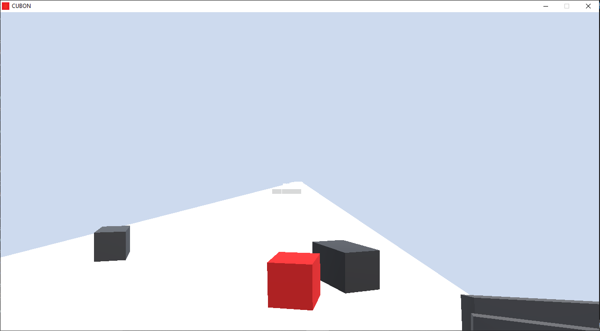
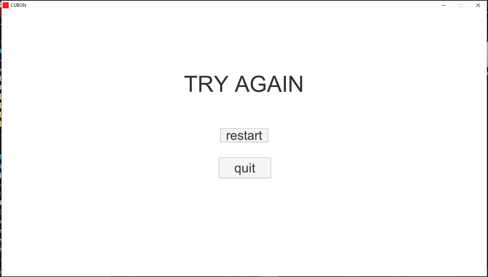

# PC Game Project | Cubon

## Overview
Developed a basic PC game as a self-learning project during college, applying programming logic, problem-solving, and game development principles. This project demonstrates skills in game mechanics, UI design, and animation.

## Tech Stack
- **Programming Language**: C#
- **Game Engine**: Unity
- **3D Modeling**: Blender (for assets)

## Game Play UI Screenshots

